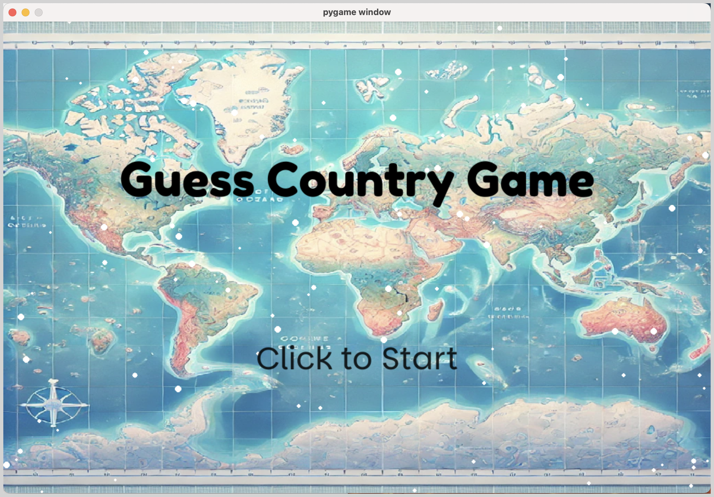
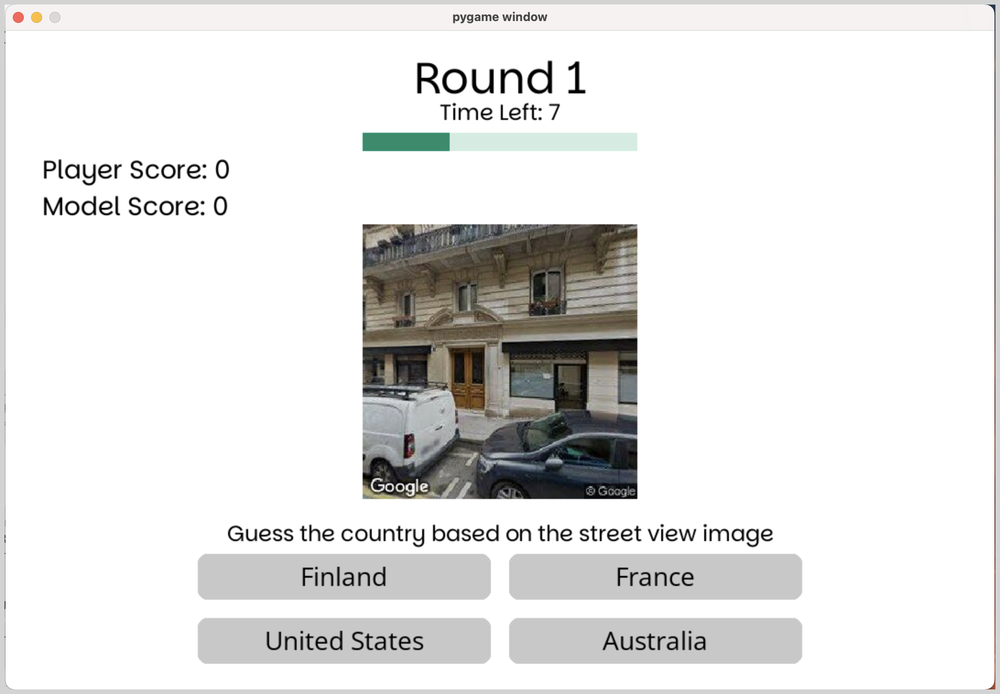
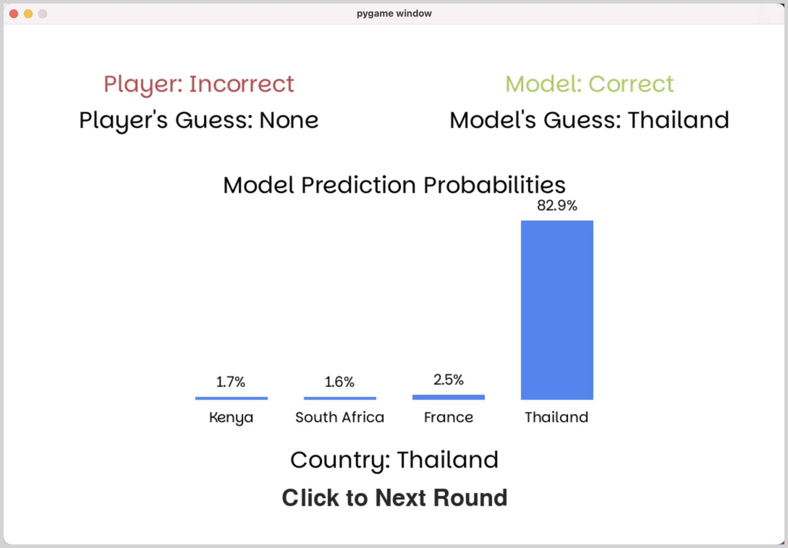

# Street View Recognition Game

This project implements a Street View Recognition Game, which is inspired by GeoGuessr, where players compete against a machine learning model in predicting locations based on images. The project is divided into three main components: data collection, model training, and gameplay.

---

## Table of Contents
- [Preview](#preview)
- [Overview](#overview)
- [Folder Hierarchy](#folder-hierarchy)
- [Setup and Installation](#setup-and-installation)
- [Data Collection](#data-collection)
- [Model Training](#model-training)
- [Gameplay](#gameplay)
- [Future Improvements](#future-improvements)
- [Acknowledgments](#acknowledgments)

---

## Preview

Below are the main scenes of the game:

### 1. Start Scene
This is the initial screen where the player can start the game or configure settings.



### 2. Game Scene
In this scene, the player views an image and makes their prediction.



### 3. Result Scene
After making a prediction, the results for the current round are displayed.



### 4. Final Result Scene
This scene shows the overall results after all rounds are completed.


---

## Overview

The goal of this project is to create a game where:
1. **Players** view an image and predict its location.
2. **The model** makes its own predictions based on training data.

The closer the predictions are to the correct location, the higher the score. This project involves:
- **Data collection**: Using APIs to collect geotagged images.
- **Model training**: Developing and training a machine learning model for location prediction.
- **Interactive gameplay**: Allowing players to compete against the model.

---

## Folder Hierarchy
The project is organized as follows:

```plaintext
Street-View-Recognition
├── /data                           # Handles dataset collection, cleaning, and preprocessing
│   ├── /256x256_global             # Contains the entire dataset
│   ├── /processed                  # Contains split training and validation sets
│   │   ├── train/                  # Training images
│   │   ├── val/                    # Validation images
│   │   ├── train.csv               # Metadata for training set (image path and country name)
│   │   └── val.csv                 # Metadata for validation set (image path and country name)
│   ├── /delete_example             # Examples of deleted images
│   ├── get_images_global.py        # Collects geotagged images for specific cities/countries
│   ├── get_images_random.py        # Collects images from random locations
│   ├── train_test_split.py         # Splits dataset into training and validation sets
│   ├── delete_images.py            # Removes invalid or unwanted images
│   └── size_convert.py             # Script for resizing images
├── /code                           # Contains the core ML/DL logic for model training and evaluation
│   ├── main.py                     # Model training script
│   ├── model.py                    # Defines the StreetViewNet model using Vision Transformer (ViT)
│   ├── validate_model.py           # Validates the model's performance and visualizes embeddings
│   ├── stack_image.py              # Custom dataset loader for training
│   ├── args.py                     # Defines hyperparameters and configurations for training
│   ├── evaluate_model.ipynb        # Displays loss and accuracy during evaluation
│   └── requirements.txt            # Python dependencies
├── /geoguessr_game                 # Hosts the game logic and presentation
│   ├── main.py                     # Game entry point
│   ├── scene_manager.py            # Manages game scenes (e.g., start, gameplay, results)
│   ├── prediction.py               # Loads the trained model and makes predictions
│   ├── /assets                     # Contains images, audio, and other resources for the game
│   │   ├── /images                 # Game background images
│   │   ├── /audio                  # Sound effects
│   │   └── /fonts                  # Fonts for UI
│   ├── /model                      # Directory for pretrained model files
│   └── scene_*                     # Individual game scenes (e.g., start, result)
├── LICENSE                         # MIT License
└── README.md                       # Documentation
```

1. **/data**
  - Handles dataset collection, cleaning, and preprocessing.

2. **/code**
  - Contains the core ML/DL logic for model training and evaluation.

3. **/geoguessr_game**
  - Hosts the game logic and presentation, including assets (images, audio, fonts) and pretrained model files.

---

## Setup and Installation

1. **Clone the Repository**:
   ```bash
   git clone https://github.com/WeakGT/Street-View-Recognition.git
   cd Street-View-Recognition
   ```

2. **Install Dependencies**:
   - Create and activate a virtual environment:
     ```bash
     python -m venv myenv
     source myenv/bin/activate   # On Windows: .\env\Scripts\activate
     ```
   - Install required packages:
     ```bash
     pip install -r code/requirements.txt
     ```

3. **Set Up API Keys**:
   - Place your Google Street View API key in the appropriate scripts under `/data`.

4. **Prepare Pretrained Model**:
   - Download the pretrained model file from the [Google Drive link](https://drive.google.com/drive/folders/1azxD1o3isbxW4GBw7F5-uD6FebFlllgF).
   - Place the `.pth` file into the `./geoguessr_game/model/` directory.

---

## Data Collection

1. Collect geotagged images using Google Street View API:
   ```bash
   python data/get_images_global.py --city "Auckland" --country "New Zealand" --key YOUR_API_KEY
   ```
2. Clean and organize the data:
   ```bash
   python data/train_test_split.py
   ```

---

## Model Training

1. Train the `StreetViewNet` model:
   ```bash
   python code/main.py
   ```
2. Validate the model:
   ```bash
   python code/validate_model.py
   ```

---

## Gameplay

1. Start the game:
   ```bash
   python geoguessr_game/main.py
   ```
2. **How to Play**:
   - Players view an image and guess its location.
   - The machine learning model makes its prediction.
   - Scores are displayed based on the accuracy of predictions.

---

## Interpreting Training Results

- **Access Training Logs**:
  - After training, the logs will be saved in the `runs/` folder.
  - Use the following command to visualize the training progress:
    ```bash
    tensorboard --logdir=runs
    ```

---

## Future Improvements

- **Data Collection**:
  - Automate data cleaning and validation.
  - Expand dataset to include more countries and diverse locations.
- **Model**:
  - Implement multi-task learning for classification and regression (coordinates).
  - Experiment with lightweight backbones for faster inference.
- **Gameplay**:
  - Add real-time feedback and score tracking.
  - Improve UI with interactive maps.
- **General**:
  - Add multiplayer support and leaderboard functionality.

---

## Acknowledgments

This project is inspired by [GeoGuessr](https://www.geoguessr.com/). Special thanks to:
- [Google Street View API](https://developers.google.com/maps/documentation/streetview)
- PyTorch and the Vision Transformer (ViT) implementation

---

## License

This project is licensed under the MIT License. See [LICENSE](LICENSE) for more details.
